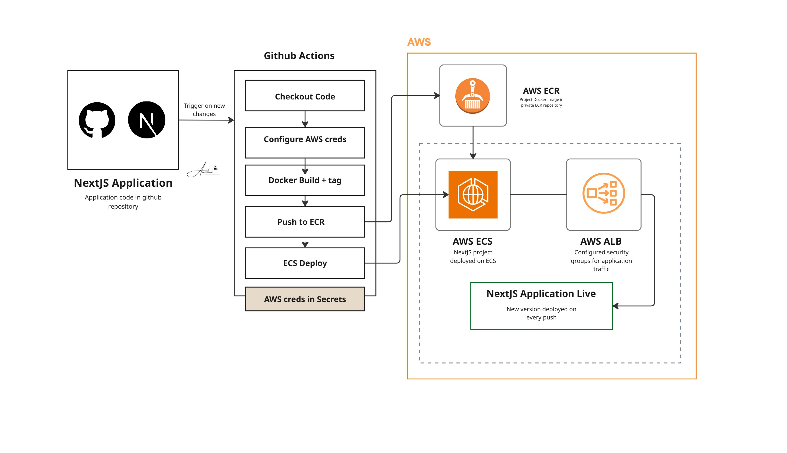

# NextJS Application Deployment on AWS ECS


## Overview

Deployed a NextJS application on AWS ECS with a fully automated GitHub Actions CI/CD pipeline. On every push to the repository, the pipeline builds a new Docker image, tags it, pushes it to Amazon ECR, and runs a new ECS task automatically. The setup includes separate security groups for the application and load balancer, a custom Task Definition, and extended ECS task execution role permissions.

## Architecture



The deployment consists of:
- **GitHub Actions** pipeline triggers on every push — builds, tags, and pushes image to ECR
- **Amazon ECR** stores the Docker image
- **AWS ECS** cluster runs the NextJS application via Task Definition and Service
- **Application Load Balancer** routes traffic with a dedicated security group
- **ecsTaskExecutionRole** extended with additional permissions for the workload

## Tech Stack

| Layer | Technology |
|-------|-----------|
| Application | NextJS |
| Containerisation | Docker |
| Image registry | Amazon ECR |
| Container orchestration | AWS ECS |
| CI/CD | GitHub Actions |
| Load balancing | AWS Application Load Balancer |
| Security | AWS Security Groups (app + ALB) |
| IAM | ecsTaskExecutionRole (extended) |

## What Was Built

**1. Security groups**
- Configured separate security group for the NextJS application container
- Configured separate security group for the Application Load Balancer
- Least privilege inbound/outbound rules on both

**2. AWS ECS cluster + Task Definition**
- Deployed an ECS cluster
- Created a Task Definition with the correct CPU, memory, and container configuration for the NextJS app
- Attached extended permissions to the ecsTaskExecutionRole for additional AWS service access

**3. ECS Service**
- Deployed the task in an ECS Service for managed, self-healing execution
- Load Balancer attached to the service for traffic routing

**4. GitHub Actions CI/CD pipeline**
- On every push: builds the Docker image, tags it with the commit SHA, pushes to ECR
- Pipeline then forces a new ECS task deployment with the updated image
- AWS credentials stored in GitHub Secrets

**5. Demo delivered**
- Demonstrated full flow: push code → pipeline runs → new image in ECR → new task running on ECS

## Project Structure

```
11-nextJS-DEVOPS/
├── deploy.yml (GitHub Actions pipeline)
├── task.json
└── README.md
```

## GitHub Actions Pipeline Flow

```
git push → GitHub Actions triggers
         → Docker build + tag with commit SHA
         → Push image to Amazon ECR
         → Force new ECS deployment
         → New task running with updated image
```

## Key Learnings

- Separating security groups for ALB and ECS container is a security best practice — ALB accepts public traffic, container only accepts traffic from ALB
- The ecsTaskExecutionRole needs to be extended when the container needs to pull from a private ECR repo or access other AWS services
- Tagging images with the commit SHA gives full traceability — you always know exactly which code version is running in production